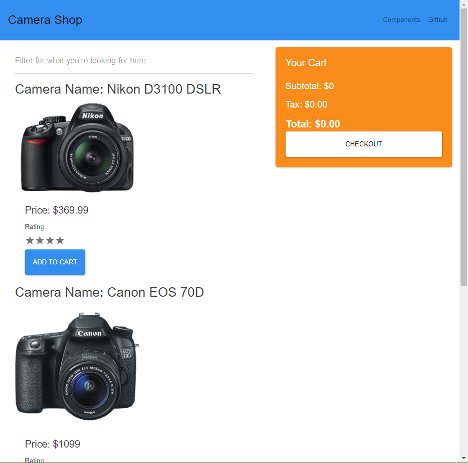
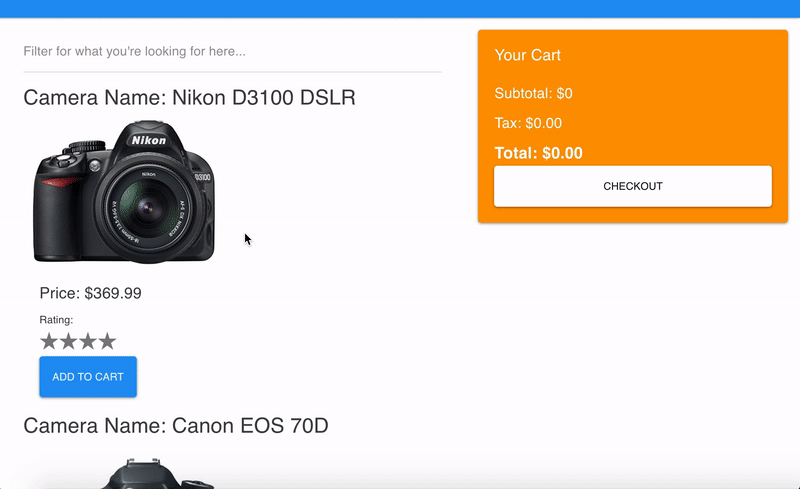

# Q3 Camera Shop Assessment

## Getting Started

```
# clone this repo
rm -rf .git
git init
git add .
git commit -m 'init'
# create your own remote repo
git push

# clone https://github.com/gSchool/collective-api-postgres - this is the backend your app needs to CRUD from/to.
# npm i && npm start
```


## Part 1

### Preparing to build

Someone from the design team sent over some mockups of our camera shops home page.
Your first step should be to diagram out the component hierarchy of the app on a whiteboard or piece of paper.

If it's easier to write things out while you are trying to solidify things, consider using a simple bulleted list. Both are simple tools for quickly mocking out a tree, which is what a component hierarchy is.

Don't worry about the sorting, add-to-cart functionality or styling at the moment,
just focus on the arrangement and nesting of components and content on the page.
Take a look at the `<App />` component provided for you as a starting point for your diagram.

Ask yourself. What logical collection of elements should be grouped together to comprise a component?
Of those components which ones should be subcomponents of another component?



Once you have sketched out the component hierarchy start to implement a static version of it in React.
Have your components render out placeholder text of the name of the component if that helps you visualize the components.

<hr />

## Part 2

### Requirements



The camera shop page will require the following functionality:

1. Display of the data in some format.
1. The price is formatted into a currency
1. The words "On SALE!" (or some form) are used when `onSale` is true
1. The ability to search to filter the results.

## Requirements - Part 2

The goal of part 2 is to add cart functionality.

### User Stories

1. When the user clicks "Add to Cart", the item is added to the cart.
1. The user can remove an item from the cart by clicking on a button.
1. The subtotal, tax (use 8.6%), and total are calculated in place.
1. The `CHECKOUT` button will have no functionality at this time.

<hr />

## Part 3

### Style your app

**Base Goal**: Use CSS to style the app.

**Stretch Goal** (only if you have already finished the version with CSS): Restyle in [Reactstrap](https://reactstrap.github.io/)

<hr />

## Stretch Goals

- The ability to sort by name or rating (default is name)
- Use the [ReactStars](https://www.npmjs.com/package/react-stars) library to replace the rating number with a set of stars. Make sure that the user can't edit the rating.
- Using React Router v4 to build a React user interface, create the ability for a user to visit "/cart", which will render a `Cart` (or `Checkout`), component.

The `Cart` (or `Checkout`) component is different from your live cart preview component, but instead the page where users will fill in their info when submitting an order.

### Bonus 1

You now have a new checkout page, and that very first component looks quite similar to our live cart preview component on the home page.
The only difference is that it doesn't display the list of items and there is no button.

Find a way to reuse your live cart preview component on the checkout page but so that the list and button don't get rendered.

### Bonus 2

Add a `<Miss />` component that renders a NotFound component for when a user visitings a path that does not exist in your app.

<hr />

## Resources

- [Reactstrap](https://reactstrap.github.io/)
- [React](https://facebook.github.io/react/)
